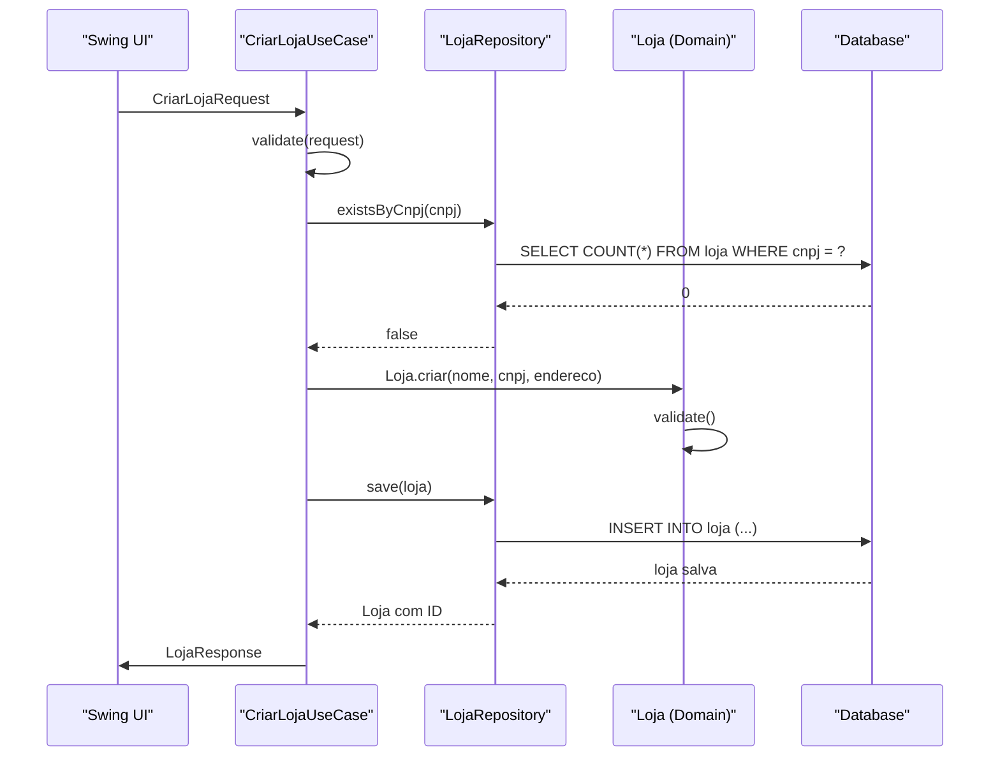

# Arquitetura Hexagonal com DDD - ArteReal Swing

## Visão Geral

Este documento descreve a arquitetura hexagonal (Ports and Adapters) combinada com Domain-Driven Design (DDD) para o sistema ArteReal, visando maior escalabilidade, testabilidade e manutenibilidade.

## Arquitetura Atual vs Proposta

### Arquitetura Atual (Problemas)
- **Acoplamento forte**: UI diretamente acoplada ao DAO
- **Dificuldade de teste**: Lógica de negócio misturada com persistência
- **Baixa coesão**: Responsabilidades misturadas nas mesmas classes
- **Dificuldade de evolução**: Mudanças em uma camada afetam outras

### Arquitetura Proposta (Solução)
- **Desacoplamento**: Camadas bem definidas com dependências invertidas
- **Alta testabilidade**: Lógica de negócio isolada e testável
- **Alta coesão**: Cada componente com responsabilidade única
- **Fácil evolução**: Mudanças localizadas e isoladas

## Estrutura da Arquitetura

```
┌─────────────────────────────────────────────────────────────────────┐
│                    Presentation Layer                     │
│  ┌─────────────────┬─────────────────┬─────────────┐ │
│  │   Swing UI     │  REST API     │  Console    │ │
│  │   Controllers   │  Controllers   │  Interface   │ │
│  └─────────────────┴─────────────────┴─────────────┘ │
└─────────────────────────────────────────────────────────────┘
                           │
                           ▼
┌─────────────────────────────────────────────────────────────┐
│                 Application Layer                      │
│  ┌─────────────────┬─────────────────┬─────────────┐ │
│  │   Use Cases    │  DTOs         │  Mappers     │ │
│  │   (Services)   │  (Request/    │  (Assemblers)│ │
│  │                 │   Response)    │             │ │
│  └─────────────────┴─────────────────┴─────────────┘ │
└─────────────────────────────────────────────────────────────┘
                           │
                           ▼
┌─────────────────────────────────────────────────────────────┐
│                  Domain Layer                          │
│  ┌─────────────────┬─────────────────┬─────────────┐ │
│  │   Entities     │  Value Objects │  Domain     │ │
│  │   (Aggregates) │               │  Services    │ │
│  │                 │               │  (Rules)    │ │
│  │   Repositories  │  Events        │  Validators  │ │
│  │   (Interfaces) │               │             │ │
│  └─────────────────┴─────────────────┴─────────────┘ │
└─────────────────────────────────────────────────────────────┘
                           ▲
                           │
┌─────────────────────────────────────────────────────────────┐
│               Infrastructure Layer                    │
│  ┌─────────────────┬─────────────────┬─────────────┐ │
│  │   Database     │  External      │  Messaging   │ │
│  │   Adapters     │  Adapters     │  Adapters   │ │
│  │   (JPA/        │  (REST/       │  (JMS/      │ │
│  │   JDBC)         │  SOAP)         │  Rabbit)    │ │
│  └─────────────────┴─────────────────┴─────────────┘ │
└─────────────────────────────────────────────────────────────┘
```

## Implementação Detalhada

### 1. Domain Layer (Núcleo do Negócio)

#### Entidades e Agregados
```java
// Entidade principal - Loja
package com.artereal.domain.loja;

@Entity
public class Loja extends AggregateRoot {
    private LojaId id;
    private String nome;
    private String cnpj;
    private Endereco endereco;
    private List< Irmao > irmaos;
    private List< Caixa > caixas;
    private StatusLoja status;
    
    // Construtores privados
    private Loja(LojaId id, String nome, String cnpj, Endereco endereco) {
        this.id = Objects.requireNonNull(id);
        this.nome = Objects.requireNonNull(nome);
        this.cnpj = Objects.requireNonNull(cnpj);
        this.endereco = Objects.requireNonNull(endereco);
        this.irmaos = new ArrayList<>();
        this.caixas = new ArrayList<>();
        this.status = StatusLoja.ATIVA;
        
        validate();
    }
    
    // Factory method
    public static Loja criar(String nome, String cnpj, Endereco endereco) {
        return new Loja(LojaId.generate(), nome, cnpj, endereco);
    }
    
    // Business methods
    public void adicionarIrmao(Irmao irmao) {
        Objects.requireNonNull(irmao);
        if (irmaos.contains(irmao)) {
            throw new IrmaoJaAssociadoException(irmao.getId(), this.id);
        }
        if (irmaos.size() >= MAX_IRMAOS_POR_LOJA) {
            throw new LimiteIrmaosExcedidoException(MAX_IRMAOS_POR_LOJA);
        }
        irmaos.add(irmao);
        
        DomainEventPublisher.publish(new IrmaoAssociadoEvent(this.id, irmao.getId()));
    }
    
    public void removerIrmao(IrmaoId irmaoId) {
        Objects.requireNonNull(irmaoId);
        Irmao irmao = encontrarIrmao(irmaoId);
        if (irmao == null) {
            throw new IrmaoNaoEncontradoException(irmaoId);
        }
        irmaos.remove(irmao);
        
        DomainEventPublisher.publish(new IrmaoRemovidoEvent(this.id, irmaoId));
    }
    
    public void abrirCaixa(BigDecimal valor, String responsavel) {
        validateStatusAberto();
        Caixa caixa = Caixa.abrir(valor, responsavel, this.id);
        caixas.add(caixa);
        
        DomainEventPublisher.publish(new CaixaAbertoEvent(caixa.getId(), this.id, valor));
    }
    
    public void fecharCaixa(CaixaId caixaId) {
        Caixa caixa = encontrarCaixa(caixaId);
        if (caixa == null) {
            throw new CaixaNaoEncontradoException(caixaId);
        }
        caixa.fechar();
        
        DomainEventPublisher.publish(new CaixaFechadoEvent(caixa.getId(), this.id, caixa.getSaldo()));
    }
    
    // Private methods
    private void validate() {
        if (nome == null || nome.trim().isEmpty()) {
            throw new LojaNomeInvalidoException("Nome da loja é obrigatório");
        }
        if (cnpj == null || !CnpjValidator.isValid(cnpj)) {
            throw new LojaCnpjInvalidoException("CNPJ inválido");
        }
    }
    
    private Irmao encontrarIrmao(IrmaoId id) {
        return irmaos.stream()
            .filter(i -> i.getId().equals(id))
            .findFirst()
            .orElse(null);
    }
    
    // Getters sem setters (imutabilidade)
    public LojaId getId() { return id; }
    public String getNome() { return nome; }
    public String getCnpj() { return cnpj; }
    public Endereco getEndereco() { return endereco; }
    public List<Irmao> getIrmaos() { return Collections.unmodifiableList(irmaos); }
    public List<Caixa> getCaixas() { return Collections.unmodifiableList(caixas); }
    public StatusLoja getStatus() { return status; }
}
```

#### Value Objects
```java
package com.artereal.domain.loja;

public record Endereco(
    String rua,
    String numero,
    String complemento,
    String bairro,
    String cidade,
    String estado,
    String cep
) {
    public Endereco {
        validate();
    }
    
    private void validate() {
        if (rua == null || rua.trim().isEmpty()) {
            throw new EnderecoInvalidoException("Rua é obrigatória");
        }
        if (cidade == null || cidade.trim().isEmpty()) {
            throw new EnderecoInvalidoException("Cidade é obrigatória");
        }
        if (estado == null || estado.trim().isEmpty()) {
            throw new EnderecoInvalidoException("Estado é obrigatório");
        }
    }
    
    public String getEnderecoCompleto() {
        return String.format("%s, %s - %s/%s", 
            rua + " " + numero, cidade, estado, cep);
    }
}

public record Cnpj(String valor) {
    public Cnpj {
        validate();
    }
    
    private void validate() {
        if (valor == null || !isValid(valor)) {
            throw new CnpjInvalidoException("CNPJ inválido");
        }
    }
    
    public static boolean isValid(String cnpj) {
        // Lógica de validação de CNPJ
        return cnpj != null && cnpj.matches("\\d{14}");
    }
    
    public String formatado() {
        return String.format("%s.%s.%s/%s-%s",
            valor.substring(0, 2),
            valor.substring(2, 5),
            valor.substring(5, 8),
            valor.substring(8, 12),
            valor.substring(12, 14)
        );
    }
}
```

#### Domain Services
```java
package com.artereal.domain.loja;

@Service
public class LojaDomainService {
    private final LojaRepository lojaRepository;
    private final IrmaoRepository irmaoRepository;
    
    public LojaDomainService(LojaRepository lojaRepository, 
                           IrmaoRepository irmaoRepository) {
        this.lojaRepository = Objects.requireNonNull(lojaRepository);
        this.irmaoRepository = Objects.requireNonNull(irmaoRepository);
    }
    
    @Transactional
    public Loja transferirIrmao(LojaId lojaOrigemId, 
                                LojaId lojaDestinoId, 
                                IrmaoId irmaoId) {
        Loja lojaOrigem = lojaRepository.findById(lojaOrigemId)
            .orElseThrow(() -> new LojaNaoEncontradaException(lojaOrigemId));
        Loja lojaDestino = lojaRepository.findById(lojaDestinoId)
            .orElseThrow(() -> new LojaNaoEncontradaException(lojaDestinoId));
        
        Irmao irmao = irmaoRepository.findById(irmaoId)
            .orElseThrow(() -> new IrmaoNaoEncontradoException(irmaoId));
        
        // Validar regras de negócio
        validarTransferencia(lojaOrigem, lojaDestino, irmao);
        
        // Executar transferência
        lojaOrigem.removerIrmao(irmaoId);
        lojaDestino.adicionarIrmao(irmao);
        
        lojaRepository.save(lojaOrigem);
        lojaRepository.save(lojaDestino);
        
        return lojaDestino;
    }
    
    private void validarTransferencia(Loja origem, Loja destino, Irmao irmao) {
        if (origem.getStatus() != StatusLoja.ATIVA) {
            throw new LojaInativaException(origem.getId());
        }
        if (destino.getStatus() != StatusLoja.ATIVA) {
            throw new LojaInativaException(destino.getId());
        }
        if (destino.getIrmaos().size() >= MAX_IRMAOS_POR_LOJA) {
            throw new LojaSemCapacidadeException(destino.getId());
        }
    }
}
```

#### Repositories (Interfaces)
```java
package com.artereal.domain.loja;

@Repository
public interface LojaRepository {
    Optional<Loja> findById(LojaId id);
    List<Loja> findByStatus(StatusLoja status);
    List<Loja> findByCidade(String cidade);
    void save(Loja loja);
    void delete(LojaId id);
    boolean existsByCnpj(Cnpj cnpj);
    List<Loja> findAll();
}

@Repository
public interface IrmaoRepository {
    Optional<Irmao> findById(IrmaoId id);
    List<Irmao> findByLojaId(LojaId lojaId);
    void save(Irmao irmao);
    void delete(IrmaoId id);
    boolean existsByCpf(String cpf);
    List<Irmao> findAll();
}
```

### 2. Application Layer (Casos de Uso)

#### Use Cases
```java
package com.artereal.application.loja;

@Service
@Transactional
public class CriarLojaUseCase {
    private final LojaRepository lojaRepository;
    private final LojaDomainService lojaDomainService;
    private final LojaMapper lojaMapper;
    
    public CriarLojaUseCase(LojaRepository lojaRepository,
                            LojaDomainService lojaDomainService,
                            LojaMapper lojaMapper) {
        this.lojaRepository = Objects.requireNonNull(lojaRepository);
        this.lojaDomainService = Objects.requireNonNull(lojaDomainService);
        this.lojaMapper = Objects.requireNonNull(lojaMapper);
    }
    
    public LojaResponse execute(CriarLojaRequest request) {
        // Validação da requisição
        CriarLojaValidator.validate(request);
        
        // Verificar duplicidade
        if (lojaRepository.existsByCnpj(new Cnpj(request.cnpj()))) {
            throw new LojaJaExisteException(request.cnpj());
        }
        
        // Criar entidade de domínio
        Endereco endereco = new Endereco(
            request.endereco().rua(),
            request.endereco().numero(),
            request.endereco().complemento(),
            request.endereco().bairro(),
            request.endereco().cidade(),
            request.endereco().estado(),
            request.endereco().cep()
        );
        
        Loja loja = Loja.criar(
            request.nome(),
            request.cnpj(),
            endereco
        );
        
        // Salvar
        Loja lojaSalva = lojaRepository.save(loja);
        
        // Retornar response
        return lojaMapper.toResponse(lojaSalva);
    }
    
    public List<LojaResponse> findByCidade(String cidade) {
        List<Loja> lojas = lojaRepository.findByCidade(cidade);
        return lojas.stream()
            .map(lojaMapper::toResponse)
            .collect(Collectors.toList());
    }
}
```

#### DTOs
```java
package com.artereal.application.loja.dto;

public record CriarLojaRequest(
    String nome,
    String cnpj,
    EnderecoRequest endereco
) {
    public CriarLojaRequest {
        validate();
    }
    
    private void validate() {
        if (nome == null || nome.trim().isEmpty()) {
            throw new RequestInvalidaException("Nome é obrigatório");
        }
        if (cnpj == null || cnpj.trim().isEmpty()) {
            throw new RequestInvalidaException("CNPJ é obrigatório");
        }
    }
}

public record EnderecoRequest(
    String rua,
    String numero,
    String complemento,
    String bairro,
    String cidade,
    String estado,
    String cep
) {}

public record LojaResponse(
    String id,
    String nome,
    String cnpj,
    EnderecoResponse endereco,
    String status,
    int quantidadeIrmaos,
    int quantidadeCaixas
) {}

public record EnderecoResponse(
    String rua,
    String numero,
    String complemento,
    String bairro,
    String cidade,
    String estado,
    String cep,
    String enderecoCompleto
) {}
```

#### Mappers
```java
package com.artereal.application.loja.mapper;

@Component
public class LojaMapper {
    
    public LojaResponse toResponse(Loja loja) {
        return new LojaResponse(
            loja.getId().getValue(),
            loja.getNome(),
            loja.getCnpj().formatado(),
            toEnderecoResponse(loja.getEndereco()),
            loja.getStatus().name(),
            loja.getIrmaos().size(),
            loja.getCaixas().size()
        );
    }
    
    private EnderecoResponse toEnderecoResponse(Endereco endereco) {
        return new EnderecoResponse(
            endereco.rua(),
            endereco.numero(),
            endereco.complemento(),
            endereco.bairro(),
            endereco.cidade(),
            endereco.estado(),
            endereco.cep(),
            endereco.getEnderecoCompleto()
        );
    }
}
```

### 3. Infrastructure Layer (Adaptadores)

#### Database Adapters
```java
package com.artereal.infrastructure.persistence.loja;

@Repository
public class LojaJpaRepository implements LojaRepository {
    private final SpringJpaLojaRepository springRepository;
    private final LojaDomainMapper domainMapper;
    
    public LojaJpaRepository(SpringJpaLojaRepository springRepository,
                          LojaDomainMapper domainMapper) {
        this.springRepository = Objects.requireNonNull(springRepository);
        this.domainMapper = Objects.requireNonNull(domainMapper);
    }
    
    @Override
    public Optional<Loja> findById(LojaId id) {
        return springRepository.findById(id.getValue())
            .map(domainMapper::toDomain);
    }
    
    @Override
    public List<Loja> findByStatus(StatusLoja status) {
        return springRepository.findByStatus(status)
            .stream()
            .map(domainMapper::toDomain)
            .collect(Collectors.toList());
    }
    
    @Override
    public List<Loja> findByCidade(String cidade) {
        return springRepository.findByEnderecoCidade(cidade)
            .stream()
            .map(domainMapper::toDomain)
            .collect(Collectors.toList());
    }
    
    @Override
    public Loja save(Loja loja) {
        LojaJpaEntity jpaEntity = domainMapper.toJpaEntity(loja);
        LojaJpaEntity saved = springRepository.save(jpaEntity);
        return domainMapper.toDomain(saved);
    }
    
    @Override
    public void delete(LojaId id) {
        springRepository.deleteById(id.getValue());
    }
    
    @Override
    public boolean existsByCnpj(Cnpj cnpj) {
        return springRepository.existsByCnpj(cnpj.valor());
    }
    
    @Override
    public List<Loja> findAll() {
        return springRepository.findAll()
            .stream()
            .map(domainMapper::toDomain)
            .collect(Collectors.toList());
    }
}
```

#### External Adapters
```java
package com.artereal.infrastructure.external;

@Component
public class ReceitaFederalAdapter implements ValidadorCnpjService {
    private final ReceitaFederalClient client;
    
    public ReceitaFederalAdapter(ReceitaFederalClient client) {
        this.client = Objects.requireNonNull(client);
    }
    
    @Override
    public boolean isValido(String cnpj) {
        try {
            ReceitaFederalResponse response = client.consultarCnpj(cnpj);
            return response.isValido() && response.isAtivo();
        } catch (Exception e) {
            // Log de erro mas não falha a operação
            log.warn("Erro ao consultar CNPJ na Receita Federal: {}", e.getMessage());
            return true; // Assume válido se não conseguir consultar
        }
    }
    
    @Override
    public DadosEmpresa consultarDados(String cnpj) {
        try {
            ReceitaFederalResponse response = client.consultarCnpj(cnpj);
            return new DadosEmpresa(
                response.getNomeFantasia(),
                response.getDataAbertura(),
                response.getSituacao()
            );
        } catch (Exception e) {
            log.warn("Erro ao consultar dados da empresa: {}", e.getMessage());
            return DadosEmpresa.vazio();
        }
    }
}
```

## Configuração do Spring Boot

### Main Application
```java
package com.artereal;

@SpringBootApplication
@EnableJpaRepositories
@EnableTransactionManagement
@ComponentScan(basePackages = {
    "com.artereal.domain",
    "com.artereal.application", 
    "com.artereal.infrastructure"
})
public class ArteRealApplication {
    
    public static void main(String[] args) {
        SpringApplication.run(ArteRealApplication.class, args);
    }
}
```

### Configuration
```java
package com.artereal.infrastructure.config;

@Configuration
@EnableJpaRepositories(basePackages = "com.artereal.infrastructure.persistence")
@EnableTransactionManagement
public class DomainConfig {
    
    @Bean
    public DomainEventPublisher domainEventPublisher() {
        return new SpringDomainEventPublisher();
    }
    
    @Bean
    public Validator validator() {
        return new LocalValidatorFactoryBean()
            .afterPropertiesSet();
    }
}
```

## Benefícios da Arquitetura

### 1. Escalabilidade
- **Horizontal**: Novos ports podem ser adicionados sem afetar existentes
- **Vertical**: Cada bounded context pode escaler independentemente
- **Database**: Sharding por bounded context facilita escalabilidade

### 2. Testabilidade
- **Unit tests**: Domain entities 100% testáveis em isolamento
- **Integration tests**: Adapters testados independentemente
- **E2E tests**: Fluxos completos testáveis com mocks

### 3. Manutenibilidade
- **Single Responsibility**: Cada classe tem uma responsabilidade clara
- **Open/Closed Principle**: Aberto para extensão, fechado para modificação
- **Dependency Inversion**: Dependências apontam para interfaces

## Migração Gradual

### Fase 1: Domain Core (Sprint 1-2)
1. Criar entidades de domínio puras
2. Implementar regras de negócio
3. Criar repositories interfaces
4. Migrar testes de domínio

### Fase 2: Application Layer (Sprint 3-4)
1. Implementar use cases principais
2. Criar DTOs e validators
3. Implementar mappers
4. Migrar controllers para usar use cases

### Fase 3: Infrastructure (Sprint 5-6)
1. Implementar adapters de persistência
2. Criar adapters externos
3. Configurar injeção de dependência
4. Migrar dados existentes

### Fase 4: Refactoring (Sprint 7-8)
1. Remover código legado
2. Otimizar performance
3. Implementar monitoring
4. Documentação completa

## Padrões e Práticas

### Padrões Utilizados
- **Hexagonal Architecture**: Ports and Adapters
- **Domain-Driven Design**: Bounded Contexts
- **CQRS**: Command Query Responsibility Segregation
- **Event Sourcing**: Domain Events
- **Repository Pattern**: Abstração de persistência
- **Factory Pattern**: Criação de entidades
- **Strategy Pattern**: Validações e regras

### Práticas Recomendadas
- **TDD**: Test-Driven Development
- **Clean Code**: Nomenclatura clara e simples
- **SOLID**: Princípios de design orientado a objetos
- **DDD**: Domain-Driven Design
- **Clean Architecture**: Separação de responsabilidades

## Exemplo de Fluxo Completo

### Criar Nova Loja


## Conclusão

Esta arquitetura hexagonal com DDD proporciona:
- **Clareza**: Responsabilidades bem definidas
- **Flexibilidade**: Fácil adaptação a novas tecnologias
- **Qualidade**: Código mais robusto e testável
- **Evolução**: Sistema preparado para crescer

A migração deve ser gradual, priorizando a estabilidade do sistema enquanto a nova arquitetura é implementada.
